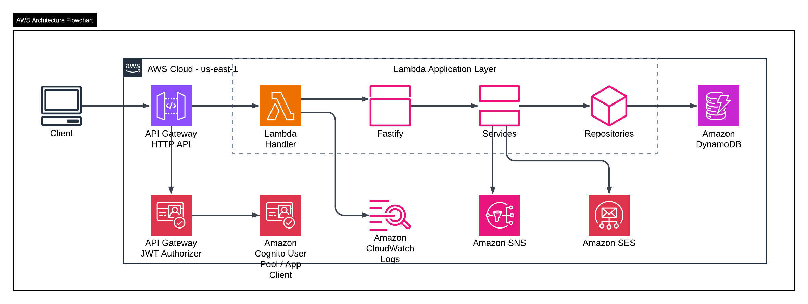

# Arquitectura

## Stack seleccionado

- `Node.js 20`
- `Fastify`
- `AWS Lambda`
- `API Gateway HTTP API`
- `Amazon Cognito User Pool`
- `DynamoDB single-table`
- `SNS`
- `SES`
- `Serverless Framework`

## Justificacion

### Node.js + Fastify

- Alineado con la instruccion recibida por correo para desarrollar en `Node.js-JavaScript`.
- Rapido de montar y mantener.
- Buen fit para ejecucion serverless.

### AWS Lambda + HTTP API

- Reduce costo operativo.
- Evita administrar servidores.
- Permite responder bien al requerimiento de despliegue en AWS.

### Cognito + JWT authorizer

- Se delega autenticacion a un servicio administrado.
- API Gateway valida tokens antes de llegar a la Lambda.
- Menor complejidad y latencia que una Lambda authorizer custom.
- La API expone `/auth/register` y `/auth/login` para orquestar Cognito sin mezclar la logica de negocio con contraseñas o emision manual de JWT.

### DynamoDB

- Encaja con el requerimiento de modelo NoSQL.
- El patron de acceso principal es por cliente, suscripciones e historial.
- `TransactWriteItems` permite mantener consistencia en operaciones financieras simples.

### SNS/SES

- Cubren de forma nativa la notificacion por SMS y email pedida por el enunciado.

## Diagrama

  

Diagrama cloud detallado:

- [docs/cloud-architecture.md](C:/Users/quich/Documents/PruebaTecnica/docs/cloud-architecture.md)

## Flujo de autenticacion

1. El cliente invoca `POST /auth/register` o `POST /auth/login`.
2. La API orquesta `Amazon Cognito`.
3. Cognito entrega un JWT.
4. El cliente invoca las rutas protegidas con `Authorization: Bearer <token>`.
5. API Gateway valida `issuer` y `audience`.
6. Lambda recibe solo peticiones autorizadas.
7. Fastify lee los claims y aplica autorizacion fina.

## Flujo de registro

1. El cliente llama `POST /auth/register`.
2. La API crea el usuario en Cognito.
3. Se establece password permanente.
4. Se agrega al grupo `customer`.
5. Se consulta el `sub` generado por Cognito.
6. Se crea el perfil de negocio en DynamoDB usando ese `sub` como `customerId`.
7. La API devuelve tokens y el perfil inicial del cliente.

## Flujo de suscripcion

1. El cliente consulta el catalogo.
2. Solicita apertura de suscripcion.
3. La aplicacion asegura que exista perfil del cliente.
4. Se valida existencia del fondo.
5. Se valida que no exista suscripcion activa al mismo fondo.
6. Se valida saldo disponible.
7. Se ejecuta `TransactWriteItems`:
   - descuento de saldo
   - creacion de suscripcion
   - registro de transaccion
8. Se envia notificacion por `SES` o `SNS`.
9. Se actualiza estado de notificacion en la transaccion.

## Modelo NoSQL

Tabla: `btg-funds-<stage>`

### Items

- `PK=CUSTOMER#<customerId>`, `SK=PROFILE`
- `PK=CUSTOMER#<customerId>`, `SK=SUBSCRIPTION#<fundId>`
- `PK=CUSTOMER#<customerId>`, `SK=TRANSACTION#<timestamp>#<transactionId>`
- `PK=FUND#<fundId>`, `SK=METADATA`

### GSI

- `GSI1PK=EMAIL#<email>`
- `GSI1SK=PROFILE`

### Ventajas del modelo

- Todas las consultas principales salen por particion del cliente.
- El historial queda naturalmente ordenable por `SK`.
- El catalogo de fondos es simple de consultar y seedear.

## Seguridad

- Cognito para autenticacion.
- JWT authorizer en API Gateway.
- Roles `admin` y `customer` con grupos de Cognito.
- DynamoDB con cifrado administrado por AWS.
- HTTPS en transito.
- Variables sensibles fuera del codigo.
- IAM con permisos acotados.

## Perfilamiento por roles

La solucion define dos roles:

- `customer`
- `admin`

### Customer

Puede operar su propio dominio de negocio:

- ver perfil y saldo
- consultar fondos
- abrir suscripciones
- cancelar suscripciones
- ver su historial

### Admin

Puede realizar consultas de supervision:

- `GET /admin/customers`
- `GET /admin/customers/:customerId`
- `GET /admin/customers/:customerId/transactions`

Esto da soporte a:

- auditoria
- trazabilidad operativa
- soporte funcional

## Riesgos y tradeoffs

- En local se usa bypass de autenticacion por practicidad; en AWS no aplica.
- La notificacion es best-effort y no revierte la transaccion financiera si falla.
- El catalogo de fondos es estatico para ajustarse al alcance del ejercicio.
