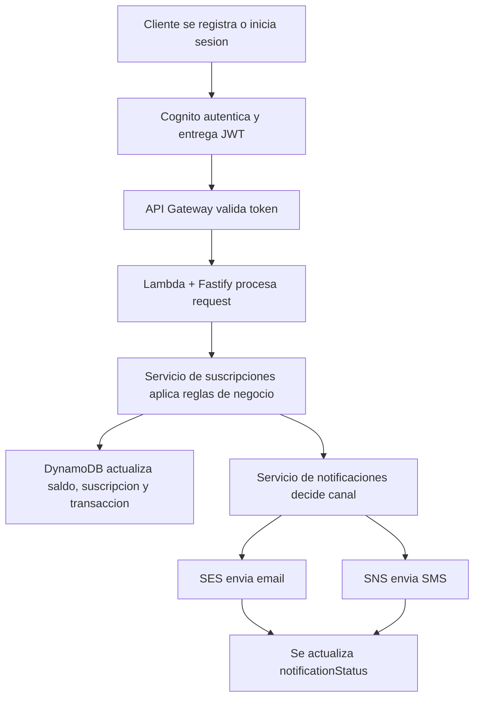

# Diagrama de Arquitectura Cloud

## Vista de despliegue AWS

  

Archivo fuente adicional:

- `docs/arquitectura.pdf`

## Vista funcional

## Componentes clave

- `API Gateway HTTP API`
  Expone endpoints publicos y protegidos.

- `Amazon Cognito`
  Gestiona usuarios, login y emision de JWT.

- `AWS Lambda`
  Ejecuta la API Node.js con Fastify.

- `DynamoDB`
  Persiste perfil del cliente, saldo, fondos, suscripciones e historial.

- `SES`
  Canal de notificacion por correo.

- `SNS`
  Canal de notificacion por SMS.

- `CloudWatch`
  Centraliza logs y trazabilidad operativa.

## Narrativa para sustentacion

1. El cliente se registra o inicia sesion contra la API.
2. La API orquesta Cognito para obtener el JWT.
3. Las rutas protegidas pasan por `JWT authorizer` en API Gateway.
4. Lambda ejecuta Fastify y aplica la logica de negocio.
5. DynamoDB conserva el estado financiero y el historial del cliente.
6. El sistema intenta enviar notificacion por `SES` o `SNS`.
7. El resultado del envio queda trazado en `notificationStatus`.
